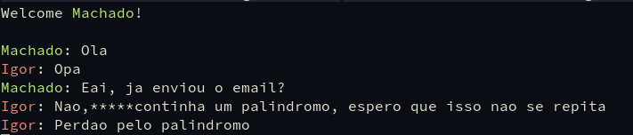

# RPC smart chat

* Para compilar:
    ```shell
    make
    ```

* Executar o servidor:
    ```shell
    ./out/server
    ```

* Executar o cliente:
    ```shell
    ./out/client <ip-servidor>
    ```

### Exemplo:

